<div align="center">

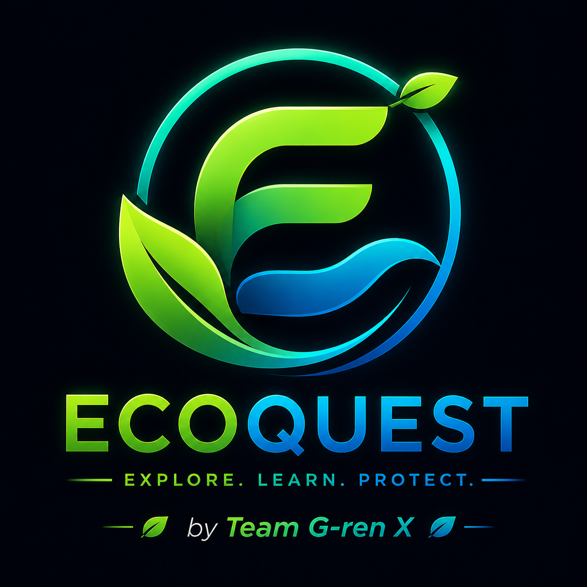

# 🌍 EcoQuest

### AI-Powered Environmental Sustainability Platform for Schools

**Transforming environmental problems into collaborative quests using Google Gemini AI.**

Built for the **USAII® Global AI Hackathon 2026**

</div>

---

EcoQuest is an AI-powered environmental sustainability platform that transforms environmental problems into collaborative quests for students.

Instead of simply reporting litter or environmental hazards, students capture a photo, and **EcoQuest AI** analyzes the scene, estimates its environmental impact, generates a collaborative quest, recommends the required volunteers and equipment, verifies completed cleanups using AI, and rewards participants for making their school cleaner.

Beyond coordinating student action, EcoQuest provides school administrators with AI-generated sustainability reports that identify recurring environmental issues, measure cleanup impact, and recommend long-term solutions.

---

# 📸 Screenshots

| Home | Create Quest |
|------|--------------|
| 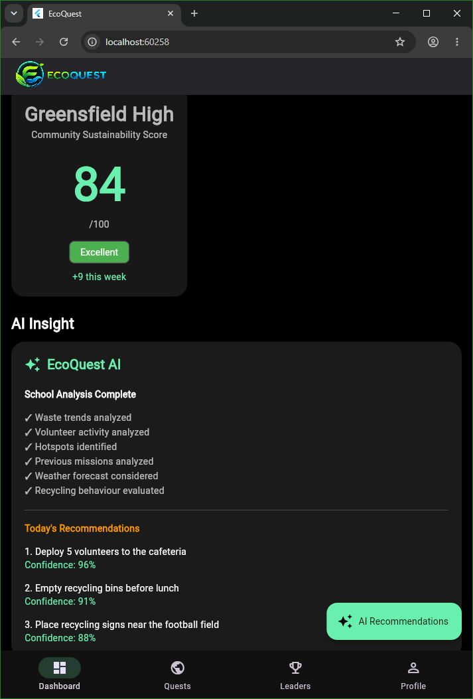 | 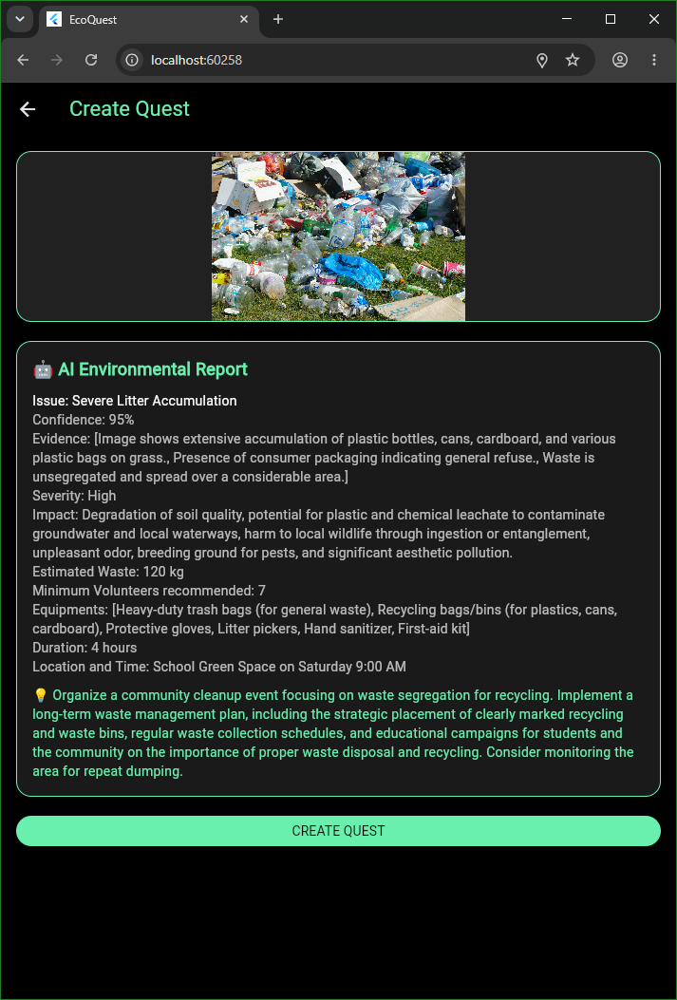 |

| AI Analysis | Available Quests |
|------------|---------------|
| 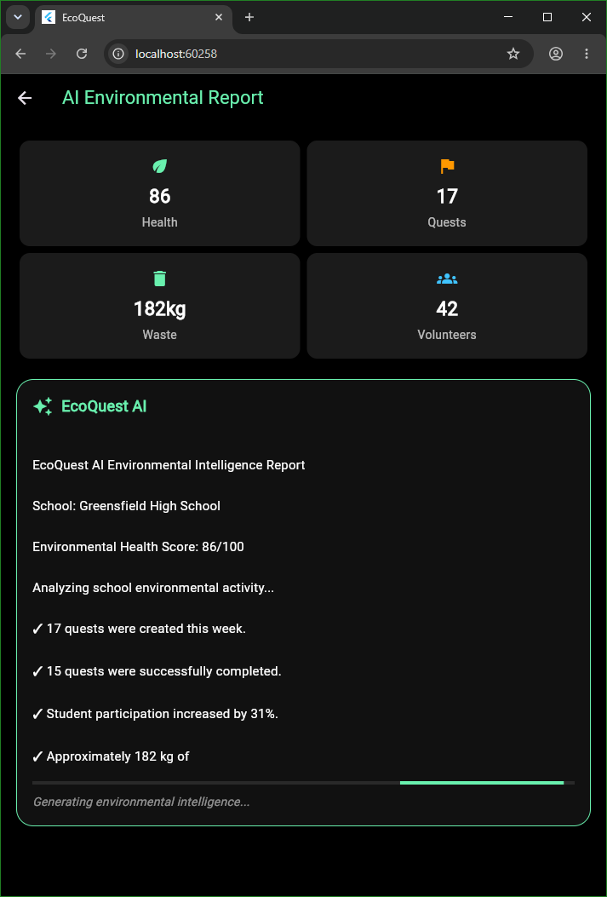 | 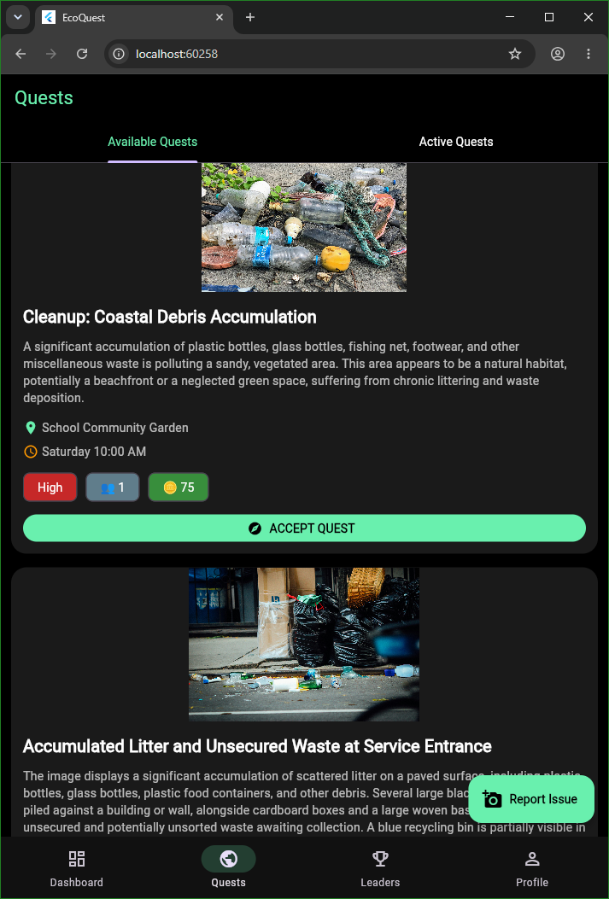 |

| Quest Details | Hotspots Analysis |
|--------------|-----------|
| 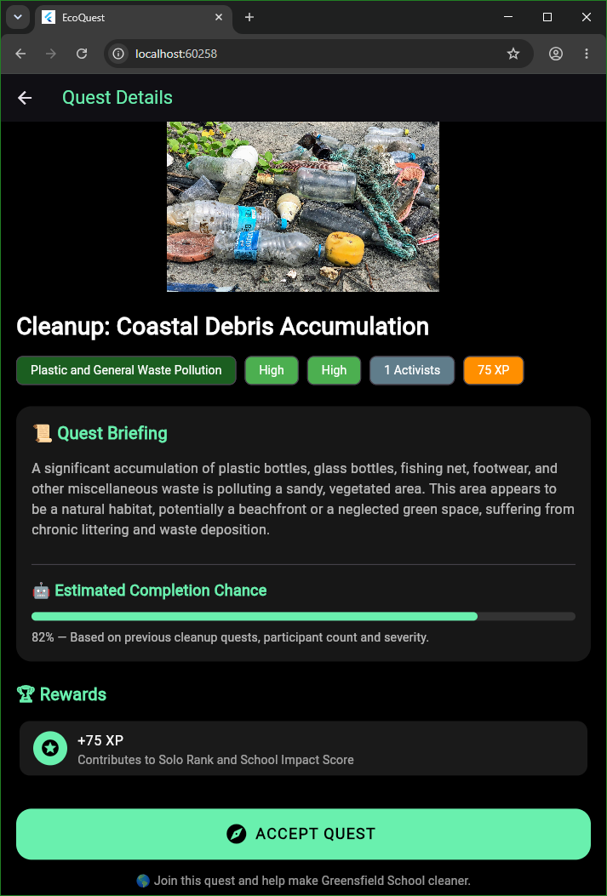 | 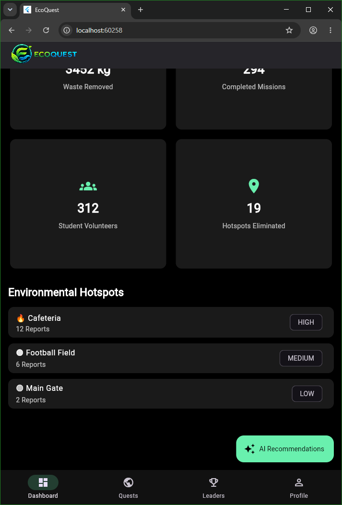 |

| Leaderboard | Profile |
|------------|---------|
| 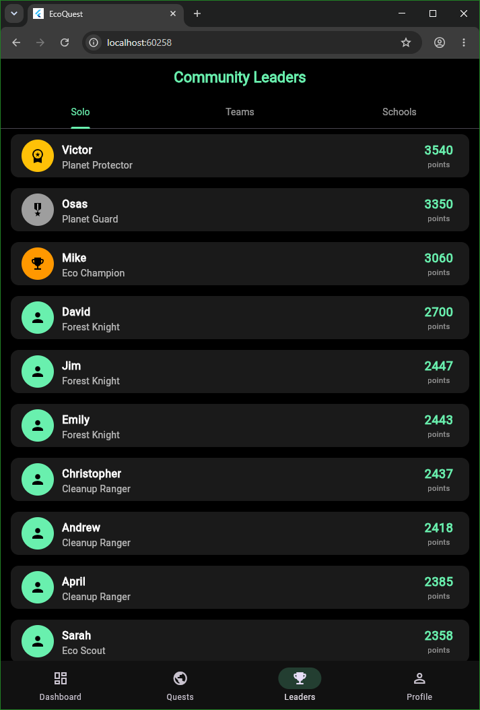 | 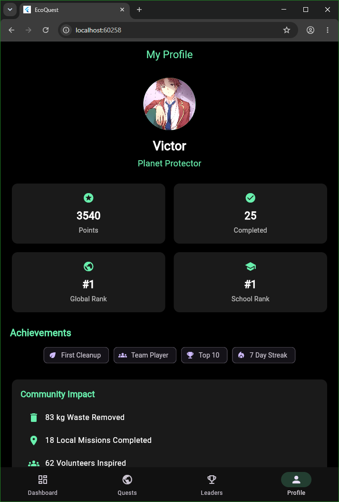 |

| AI Command Center | Cleanup Verification |
|-------------------|-----------------------|
| 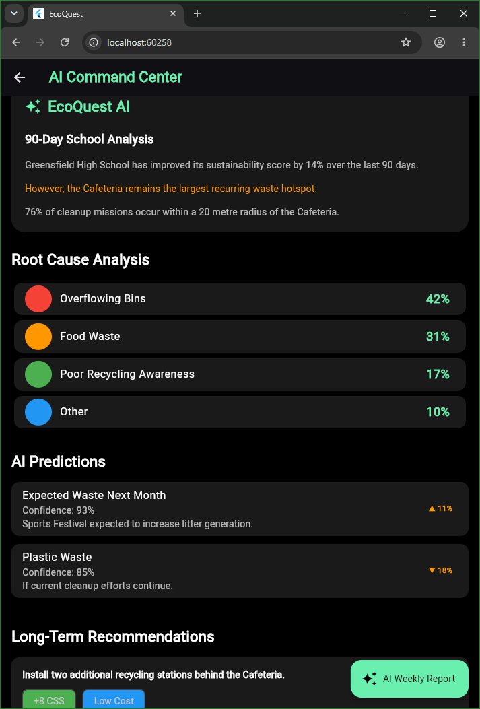 | 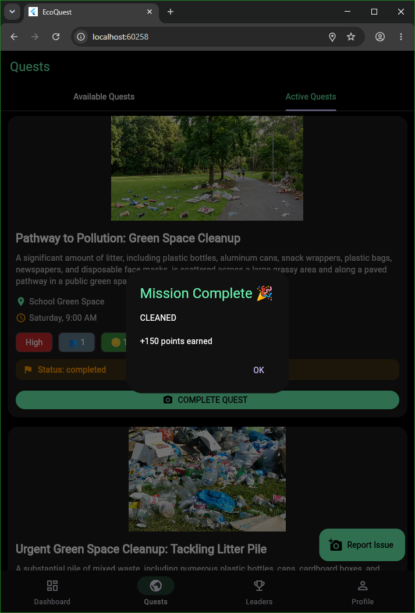 |


---

# 🚀 Features

### 🤖 AI Environmental Analysis

Students simply take a photo.

EcoQuest AI automatically:

- Detects the environmental issue
- Estimates severity
- Predicts environmental impact
- Estimates waste quantity
- Recommends volunteers
- Recommends equipment
- Predicts completion chance
- Assigns rewards
- Generates an actionable quest

---

### 🗺 Quest Discovery

Students can

- Browse nearby quests
- View quests on a map
- Read AI-generated briefings
- Join quests with one tap

---

### 📷 AI Cleanup Verification

After completing a cleanup,

Students upload an after photo.

EcoQuest AI compares

- Before image
- After image

to determine whether the area has been

- ✅ Cleaned
- 🟡 Partially Cleaned
- ❌ Not Cleaned

Rewards are automatically adjusted.

---

### 📊 AI Command Center

School administrators receive AI-generated sustainability insights including

- Environmental hotspots
- Recurring problems
- Waste trends
- AI recommendations
- Sustainability report

This helps schools move from reacting to environmental issues to preventing them.

---

### 🏆 Quest System

Students become environmental heroes by:

• Completing quests
• Earning EcoPoints
• Unlocking achievements
• Climbing leaderboards

transforming environmental action into an engaging experience.

---

# 🧠 AI Architecture

```
Student captures image
            │
            ▼
      Gemini AI Vision
            │
            ▼
Environmental Analysis
            │
            ▼
Quest Generation
            │
            ▼
Firestore Database
            │
            ▼
Students discover & accept quest
            │
            ▼
Cleanup completed
            │
            ▼
AI Before/After Verification
            │
            ▼
Rewards + Leaderboards
            │
            ▼
AI Command Center Reports
```

---

# 🛠 Tech Stack

### Frontend

- Flutter

### Backend

- Firebase Authentication
- Cloud Firestore
- Cloudinary

### Artificial Intelligence

- Google Gemini 2.5 Flash Vision

### Maps

- Google Maps

### Other Packages

- image_picker
- geolocator
- uuid
- http

---

# 📂 Project Structure

```
lib/
 ├── screens/
 ├── services/
 ├── widgets/
 ├── models/
 └── main.dart
```

---

# 🎯 Problem

Many schools rely on students or staff to manually report environmental issues.

Unfortunately,

- problems go unnoticed,
- volunteers don't know where to help,
- administrators lack environmental data,
- recurring issues continue unchecked.

---

# 💡 Solution

EcoQuest uses AI to understand environmental problems from a single image, organize collaborative cleanup efforts, verify completion, and provide school administrators with actionable sustainability insights.

Rather than replacing human action, AI coordinates and empowers it.

---

# 🌱 Future Improvements

- Push notifications for nearby quests
- AI-generated sustainability forecasts
- Multi-school competitions
- Carbon impact estimation
- Recycling detection
- Teacher dashboard
- Environmental badges and seasonal events

---

# 👥 Team

### Victor Adeoye
- AI Engineering
- Flutter Development
- Backend Integration

### Osasefe Arasomwan
- UI/UX Design
- User Experience
- Interface Design

---

# ⚠ Disclaimer

This project was created as part of the **USAII® Global AI Hackathon 2026**.

Some data shown in the application (leaderboards, reports, and analytics) is simulated for demonstration purposes.

---

# 📜 License

MIT License
